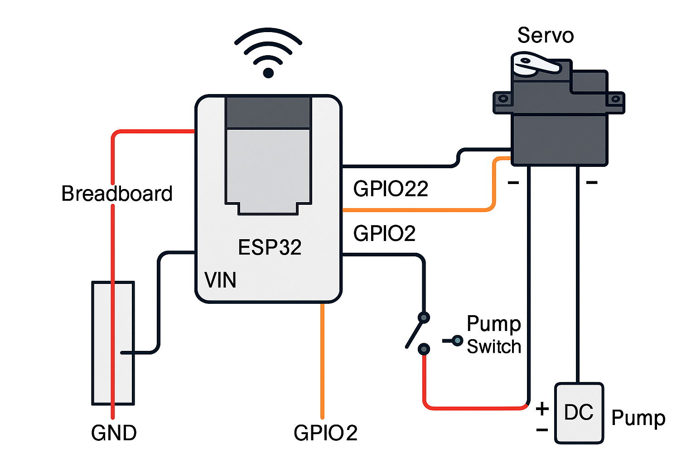

# Circuit



# How does it work?

- parameters at /servo
    - duration
    - servoindex

    eg request : 
    ```http://10.230.158.86/servo?duration=10&servoindex=0```

    in the example, the servo in index 0 is turned on for 10 seconds, the servo turns on and the water from the pesticide bottle starts pouring into the dc motor.

    after 10 seconds both the dc motor pump and the servo are turned off and return to the original position, hence pinching the pipe to close the supply of pesticides

    
